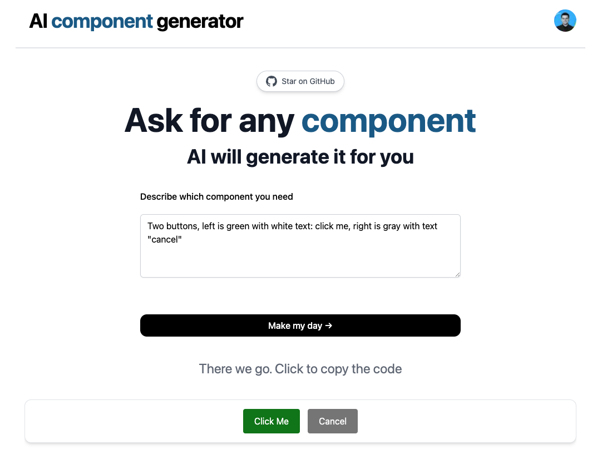

<p align="center">
  <a href="https://ai2ui.co">
    
  </a>

</p>
<h1 align="center">Welcome to AI Component Generator with ChatGPT</h1>
<p align="center">
  <a href="https://opensource.org/licenses/MIT" target="_blank">
    
  </a>
</p>


This project generates almost any UI components with OpenAI's ChatGPT and allows you to copy the html code

[](https://ai2ui.co)

# [AI2UI](https://ai2ui.co/) component generator

## How it works

This project uses the [ChatGPT API](https://openai.com/api/) and [Vercel Edge functions](https://vercel.com/features/edge-functions). 
It constructs a prompt based on the form and user input, sends it to the chatGPT API via a Vercel Edge function, then streams the response back to the application.
You can ask for any UI component, free style. Most likely it will generate the right thing for you.
This can also be used as a great bootstrap for projects, I tried to make the style Material-UI styled, but you can change this behavior.

## Export your components
You can now choose between HTML export of your UI components and your preferred combination of Tailwind CSS, Next.js, React.js, Material UI 

## Running Locally
This project is built with `Next.js` and `TailwindCSS`, so you can deploy it directly to Vercel.

After cloning the repo, go to [OpenAI](https://beta.openai.com/account/api-keys) to make an account and put your API key in a file called `.env`(OPENAI_API_KEY)
Then, run the application in the command line and it will be available at `http://localhost:3000`.

```bash
npm install

yarn dev
```

## Changing ChatGPT prompts and requests
In order to change ChatGPT response you only need to give it an example of what you wish to get back (use the assistant role to generate an example of a good response)".
In the example below I show it how to generate TailwindCSS and Next.js component, and later ask just to return the corresponding HTML code.

```javascript

// /api/generate.ts

const handler = async (req: Request): Promise<Response> => {
    const {prompt} = (await req.json()) as {
        prompt?: string;
    };

    if (!prompt) {
        return new Response("No prompt in the request", {status: 400});
    }

    const payload: OpenAIStreamPayload = {
        model: "gpt-3.5-turbo",
        messages: [
            {
                "role": "user",
                "content": "create next.js + tailwind css code for button 200 x 100, light purple background, generate text on it. Please create a complete next.js component"
            },
            {
                "role": "assistant", "content": `
                    import React from 'react';
                    const MyComponent = () => {
                      return (
                        <div className="flex flex-col items-center justify-center h-screen">
                          <h1 className="text-3xl font-bold mb-4">Hello World</h1>
                          <p className="text-lg mb-4">Welcome to my Next.js component using Tailwind CSS</p>
                          <button className="bg-purple-500 text-white px-4 py-2 rounded-lg shadow-md hover:bg-purple-700 focus:outline-none focus:ring-2 focus:ring-purple-600 focus:ring-opacity-50">Click Me</button>
                        </div>
                      );
                    };
                    export default MyComponent;
                `
            },
            {
                "role": "user",
                "content": "Please create html code with inline css what create the following component, Meterial UI look and feel, return only code"
            },
            {"role": "user", "content": prompt},
        ],
    };

    const stream = await OpenAIStream(payload);
    return new Response(stream);
};

```

## Who made this project

My name is [Alym](https://uk.linkedin.com/in/alym-karim-43232b138) - a developer at heart , I enjoy building end-to-end systems that not only look amazing, but also have real meaning and impact.

Credit also goes to [Yuval](https://www.linkedin.com/in/yuval-suede/) for the Serverless functions and inspiration for the project.

## 🤝 Contributing
Contributions, issues and feature requests are welcome!<br />
* Fork the repository, Clone it on your device. That's it 🎉
* Finally make a pull request

## 📝 License

This project is [MIT License](https://opensource.org/licenses/MIT) licensed.

***
We accept contribution with great love! Show your interest! Contribute!
